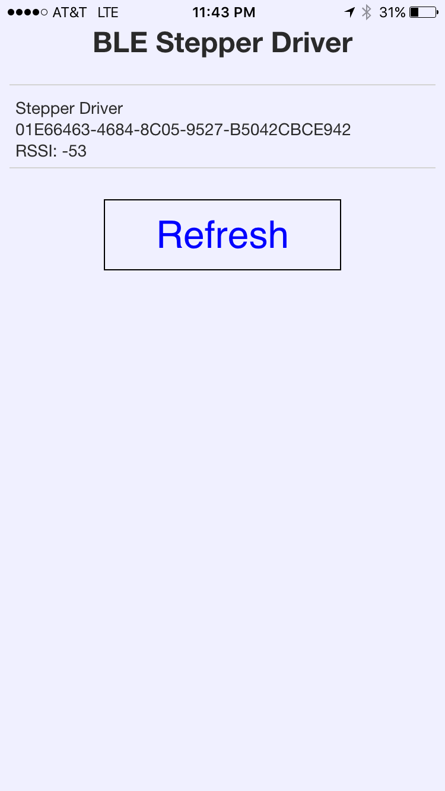
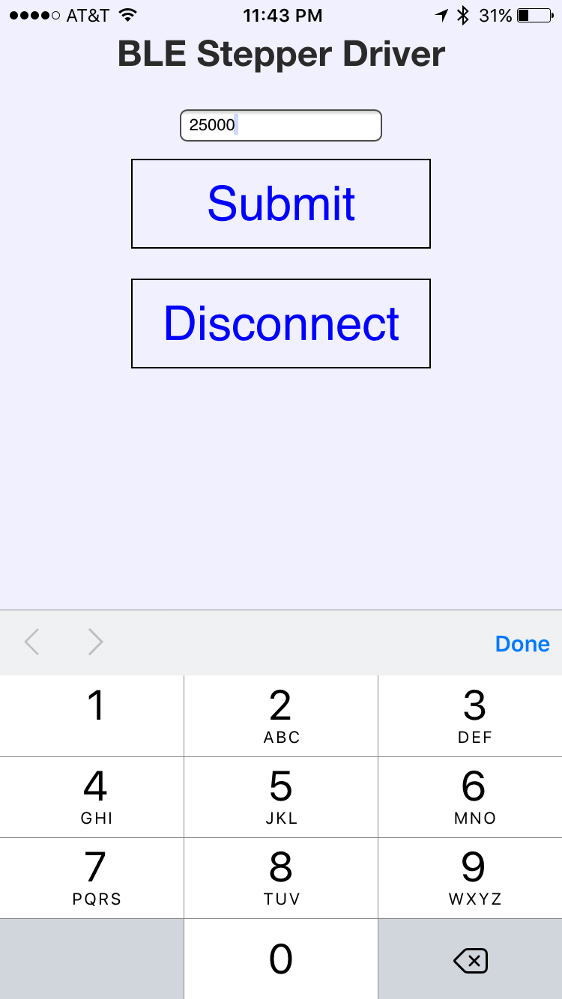

# BLE-Stepper

A simple PhoneGap app for running a stepper motor with Bluetooh LE. The RFduino controls the stepper using an Easy Driver motor board. After the app scans for BLE devices, the user can select a device and, from the detail page, can enter a number of steps for the motor to move. The stepper in the video has 1500 steps per revolution.

